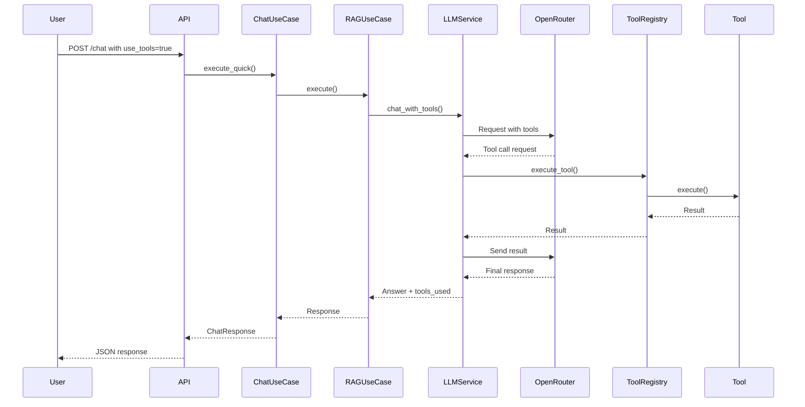

# AION Tools & Function Calling

This document provides comprehensive documentation for AION's function calling capabilities and available tools.

## Table of Contents

- [Overview](#overview)
- [Architecture](#architecture)
- [Available Tools](#available-tools)
- [Tool Choice Modes](#tool-choice-modes)
- [API Usage](#api-usage)
- [Creating Custom Tools](#creating-custom-tools)
- [Testing Tools](#testing-tools)

## Overview

AION implements **function calling** (also known as tool use), allowing the LLM to invoke external tools to enhance its capabilities beyond text generation. This enables the assistant to:

- Perform accurate calculations
- Search the web for current information
- Execute code for data transformations
- Query the user's knowledge base

### How It Works

The system implements an **agentic loop**:

1. User sends a message
2. LLM analyzes the request and decides if tools are needed
3. LLM requests specific tool(s) with arguments
4. Tool(s) execute and return results
5. LLM receives results and continues reasoning
6. Process repeats until LLM has enough information
7. Final response is generated and returned to user

This loop can iterate up to 5 times (configurable) to handle complex multi-step tasks.

## Architecture

### Components

```
src/infrastructure/tools/
├── tool_registry.py          # Central tool management
├── calculator_tool.py        # Mathematical calculations
├── web_search_tool.py        # Internet search
├── code_executor_tool.py     # Python code execution
└── knowledge_base_tool.py    # Memory & document search
```

### Tool Base Class

All tools inherit from `BaseTool` defined in `src/domain/entities/tool.py`:

```python
class BaseTool(ABC):
    @property
    @abstractmethod
    def name(self) -> str:
        """Tool name used by LLM."""
        pass

    @property
    @abstractmethod
    def description(self) -> str:
        """Detailed description of what the tool does."""
        pass

    @property
    @abstractmethod
    def parameters(self) -> list[ToolParameter]:
        """List of parameters the tool accepts."""
        pass

    @abstractmethod
    async def execute(self, **kwargs: Any) -> Any:
        """Execute the tool with given arguments."""
        pass
```

### Tool Registry

The `ToolRegistry` class manages all available tools:

```python
class ToolRegistry:
    def register(self, tool: BaseTool) -> None:
        """Register a tool for use."""

    def get_tool(self, name: str) -> BaseTool | None:
        """Get tool by name."""

    def get_tools_definitions(self) -> list[dict]:
        """Get OpenAI-compatible tool definitions."""
```

## Available Tools

### 1. Calculator Tool

**Name:** `calculator`

**Description:** Performs mathematical calculations using Python's eval() in a safe context.

**Parameters:**
- `expression` (string, required): Mathematical expression to evaluate

**Use Cases:**
- Basic arithmetic: `2 + 2`, `100 * 0.15`
- Complex formulas: `(5 + 3) * 2 / 4`
- Scientific calculations: `3.14159 * (10 ** 2)`
- Multiple operations: `156 * 78 + 234`

**Example API Request:**
```json
{
  "user_id": "david",
  "message": "What is 156 multiplied by 78, plus 234?",
  "use_tools": true,
  "tool_choice": "auto"
}
```

**Example Response:**
```json
{
  "message": "The result of 156 * 78 + 234 = 12,402",
  "tools_used": [
    {
      "name": "calculator",
      "arguments": {"expression": "156 * 78 + 234"},
      "result": 12402
    }
  ]
}
```

**Security:** Uses Python's `eval()` with restricted `__builtins__` to prevent code injection.

---

### 2. Web Search Tool

**Name:** `web_search`

**Description:** Searches the internet using DuckDuckGo (no API key required).

**Parameters:**
- `query` (string, required): Search query
- `max_results` (number, optional): Maximum results to return (default: 5, max: 10)

**Use Cases:**
- Current events: "latest AI news"
- Real-time data: "weather in San Francisco"
- Fact-checking: "population of Japan 2024"
- General information: "Python programming language"

**Example API Request:**
```json
{
  "user_id": "david",
  "message": "What's the latest news about artificial intelligence?",
  "use_tools": true,
  "tool_choice": "auto"
}
```

**Example Response:**
```json
{
  "message": "Based on recent searches, here are the latest AI developments...",
  "tools_used": [
    {
      "name": "web_search",
      "arguments": {
        "query": "latest artificial intelligence news",
        "max_results": 5
      },
      "result": {
        "query": "latest artificial intelligence news",
        "results_count": 5,
        "results": [
          {
            "position": 1,
            "title": "AI Breakthrough in 2024",
            "snippet": "Recent developments in AI...",
            "url": "https://example.com/article"
          }
        ]
      }
    }
  ]
}
```

**Rate Limiting:** DuckDuckGo may rate-limit requests. The tool includes basic error handling.

---

### 3. Code Executor Tool

**Name:** `code_executor`

**Description:** Executes Python code in a secure sandboxed environment.

**Parameters:**
- `code` (string, required): Python code to execute

**Security Features:**
- **Timeout:** 10 seconds maximum execution time
- **Restricted Imports:** Only safe modules allowed (math, datetime, json, re, collections, itertools)
- **No File System Access:** Cannot read/write files
- **No Network Access:** Cannot make HTTP requests
- **Isolated Globals:** Restricted `__builtins__`

**Use Cases:**
- Data transformations
- Algorithm execution
- Sequence generation (Fibonacci, primes, etc.)
- Complex calculations
- Data structure operations

**Example API Request:**
```json
{
  "user_id": "david",
  "message": "Generate the first 10 Fibonacci numbers using Python",
  "use_tools": true,
  "tool_choice": "auto"
}
```

**Example Response:**
```json
{
  "message": "The first 10 Fibonacci numbers are: [0, 1, 1, 2, 3, 5, 8, 13, 21, 34]",
  "tools_used": [
    {
      "name": "code_executor",
      "arguments": {
        "code": "def fibonacci(n):\n    fib = [0, 1]\n    for i in range(2, n):\n        fib.append(fib[i-1] + fib[i-2])\n    return fib\n\nresult = fibonacci(10)\nprint(result)"
      },
      "result": {
        "success": true,
        "output": "[0, 1, 1, 2, 3, 5, 8, 13, 21, 34]\n",
        "error": null
      }
    }
  ]
}
```

**Allowed Modules:**
```python
{
    "math": math,
    "datetime": datetime,
    "json": json,
    "re": re,
    "collections": collections,
    "itertools": itertools
}
```

**Error Handling:**
- Syntax errors are captured and returned in the `error` field
- Runtime errors are captured
- Timeout errors return a specific message

---

### 4. Knowledge Base Search Tool

**Name:** `knowledge_base_search`

**Description:** Searches the user's personal knowledge base (memories and documents).

**Parameters:**
- `query` (string, required): Search query
- `search_type` (string, optional): "memories", "documents", or "both" (default: "both")
- `max_results` (number, optional): Maximum results (default: 5)

**Use Cases:**
- Retrieving stored memories
- Finding relevant documents
- Accessing past conversation context
- Personal information lookup

**Example API Request:**
```json
{
  "user_id": "david",
  "message": "What documents do I have about Python?",
  "use_tools": true,
  "tool_choice": "auto"
}
```

## Tool Choice Modes

You can control how tools are used through the `tool_choice` parameter:

### 1. Auto Mode (Default)

LLM automatically decides when to use tools based on the query.

```json
{
  "message": "What is 25 + 17?",
  "use_tools": true,
  "tool_choice": "auto"
}
```

### 2. Force Specific Tool

Force the LLM to use a specific tool.

```json
{
  "message": "Tell me about Python",
  "use_tools": true,
  "tool_choice": "web_search"
}
```

Available tool names:
- `calculator`
- `web_search`
- `code_executor`
- `knowledge_base_search`

### 3. Disable Tools

Disable all tools for a specific request.

```json
{
  "message": "What is 25 + 17?",
  "use_tools": true,
  "tool_choice": "none"
}
```

In this case, the LLM will answer without using any tools.

### 4. Disable Tool Use Entirely

Don't include tool definitions in the request at all.

```json
{
  "message": "Hello, how are you?",
  "use_tools": false
}
```

## API Usage

### Chat Endpoint with Tools

**Endpoint:** `POST /api/v1/chat`

**Request Body:**
```json
{
  "user_id": "david",
  "message": "What is the square root of 144 plus 25?",
  "conversation_id": "optional-uuid",
  "use_memory": true,
  "use_knowledge_base": true,
  "use_tools": true,
  "tool_choice": "auto",
  "max_context_memories": 5,
  "max_context_documents": 10
}
```

**Response:**
```json
{
  "conversation_id": "uuid",
  "message": "The square root of 144 is 12, and 12 + 25 = 37",
  "memories_used": ["mem-id-1", "mem-id-2"],
  "documents_used": [],
  "new_memories_created": ["mem-id-3"],
  "tools_used": [
    {
      "name": "calculator",
      "arguments": {"expression": "144 ** 0.5 + 25"},
      "result": 37.0
    }
  ],
  "metadata": {
    "context_tokens": 250,
    "confidence": 0.95,
    "sources": ["Memory: conversation_123"],
    "entities_created": 0,
    "relationships_created": 0
  }
}
```

### Tool Execution Flow



## Creating Custom Tools

To create a new tool:

### 1. Create Tool Class

```python
# src/infrastructure/tools/my_custom_tool.py

from typing import Any
from src.domain.entities.tool import BaseTool, ToolParameter
from src.shared.logging import LoggerMixin

class MyCustomTool(BaseTool, LoggerMixin):
    """My custom tool description."""

    @property
    def name(self) -> str:
        return "my_custom_tool"

    @property
    def description(self) -> str:
        return """Detailed description of what the tool does.

Use this tool when:
- Condition 1
- Condition 2

Returns: Description of return value."""

    @property
    def parameters(self) -> list[ToolParameter]:
        return [
            ToolParameter(
                name="param1",
                type="string",
                description="Description of parameter 1",
                required=True,
            ),
            ToolParameter(
                name="param2",
                type="number",
                description="Description of parameter 2",
                required=False,
            ),
        ]

    async def execute(self, **kwargs: Any) -> Any:
        """Execute the tool."""
        param1 = kwargs.get("param1")
        param2 = kwargs.get("param2", default_value)

        if not param1:
            raise ValueError("Missing required parameter: param1")

        self.logger.info(
            "my_custom_tool_executing",
            param1=param1,
            param2=param2
        )

        try:
            # Tool logic here
            result = do_something(param1, param2)

            self.logger.info("my_custom_tool_success", result=result)
            return result

        except Exception as e:
            self.logger.error("my_custom_tool_error", error=str(e))
            raise Exception(f"Tool execution failed: {str(e)}") from e
```

### 2. Register the Tool

```python
# src/presentation/api/dependencies.py

from src.infrastructure.tools.my_custom_tool import MyCustomTool

@lru_cache
def get_tool_registry() -> ToolRegistry:
    registry = ToolRegistry()

    # ... existing tools ...

    # Register custom tool
    my_tool = MyCustomTool()
    registry.register(my_tool)

    return registry
```

### 3. Export the Tool

```python
# src/infrastructure/tools/__init__.py

from src.infrastructure.tools.my_custom_tool import MyCustomTool

__all__ = [
    "CalculatorTool",
    "WebSearchTool",
    "CodeExecutorTool",
    "MyCustomTool",
    "ToolRegistry",
]
```

### Best Practices

1. **Clear Descriptions**: Provide detailed descriptions that help the LLM understand when to use the tool
2. **Parameter Validation**: Always validate required parameters
3. **Error Handling**: Catch and log errors gracefully
4. **Logging**: Use structured logging for debugging
5. **Timeouts**: Implement timeouts for long-running operations
6. **Security**: Sanitize inputs and restrict dangerous operations
7. **Return Format**: Return consistent, structured data

## Testing Tools

### Unit Tests

```python
# tests/unit/tools/test_my_custom_tool.py

import pytest
from src.infrastructure.tools.my_custom_tool import MyCustomTool

@pytest.mark.asyncio
async def test_my_custom_tool_success():
    tool = MyCustomTool()
    result = await tool.execute(param1="test", param2=42)
    assert result == expected_value

@pytest.mark.asyncio
async def test_my_custom_tool_missing_param():
    tool = MyCustomTool()
    with pytest.raises(ValueError, match="Missing required parameter"):
        await tool.execute()
```

### Integration Tests

Create test scripts in the root directory:

```python
# test_my_custom_tool.py

import asyncio
from src.infrastructure.llm.openrouter_client import OpenRouterClient
from src.infrastructure.llm.llm_service import LLMService
from src.infrastructure.tools import ToolRegistry, MyCustomTool

async def test_tool():
    client = OpenRouterClient()
    registry = ToolRegistry()

    tool = MyCustomTool()
    registry.register(tool)

    llm = LLMService(client=client, tool_registry=registry)

    messages = [
        {"role": "user", "content": "Test query that should use the tool"}
    ]

    response = await llm.chat_with_tools(messages)
    print(response)

if __name__ == "__main__":
    asyncio.run(test_tool())
```

Run the test:
```bash
poetry run python test_my_custom_tool.py
```

### End-to-End Tests

Test via the API:

```bash
curl -X POST http://localhost:8000/api/v1/chat \
  -H "Content-Type: application/json" \
  -d '{
    "user_id": "test_user",
    "message": "Query that uses my custom tool",
    "use_tools": true,
    "tool_choice": "my_custom_tool"
  }'
```

## Troubleshooting

### Tool Not Being Called

1. Check tool description is clear and relevant
2. Verify tool is registered in `get_tool_registry()`
3. Check `use_tools=true` in the request
4. Try forcing the tool with `tool_choice="tool_name"`

### Tool Execution Errors

1. Check logs for error messages
2. Verify parameter validation
3. Test the tool directly with unit tests
4. Check for timeout issues

### OpenRouter API Errors

1. Verify `OPENROUTER_API_KEY` is set
2. Check OpenRouter API status
3. Review request/response logs
4. Ensure tool definitions are valid

## Performance Considerations

- **Tool Calls Add Latency**: Each tool call requires an additional round-trip to the LLM
- **Max Iterations**: Limit is 5 iterations to prevent infinite loops
- **Caching**: Consider caching tool results for identical queries
- **Async Execution**: All tools use async/await for non-blocking execution
- **Timeouts**: Implement appropriate timeouts for external services

## Future Enhancements

Potential additions to the tools system:

- [ ] File operations tool (read/write files)
- [ ] Database query tool
- [ ] Image generation tool
- [ ] Email sending tool
- [ ] Calendar integration tool
- [ ] Tool result caching
- [ ] Parallel tool execution
- [ ] Tool call history and analytics

---

**Last Updated:** November 2025
**Version:** 1.0.0
